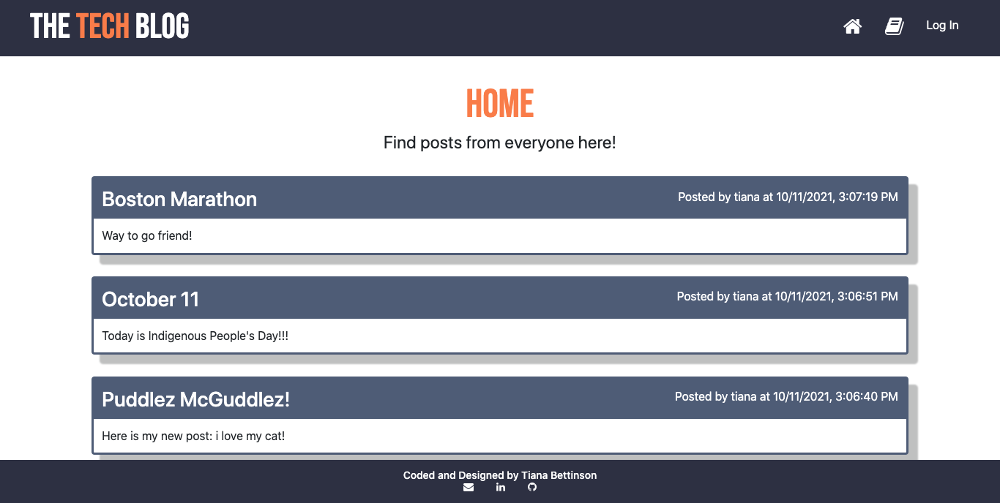
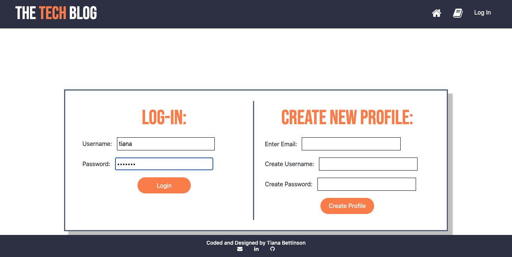
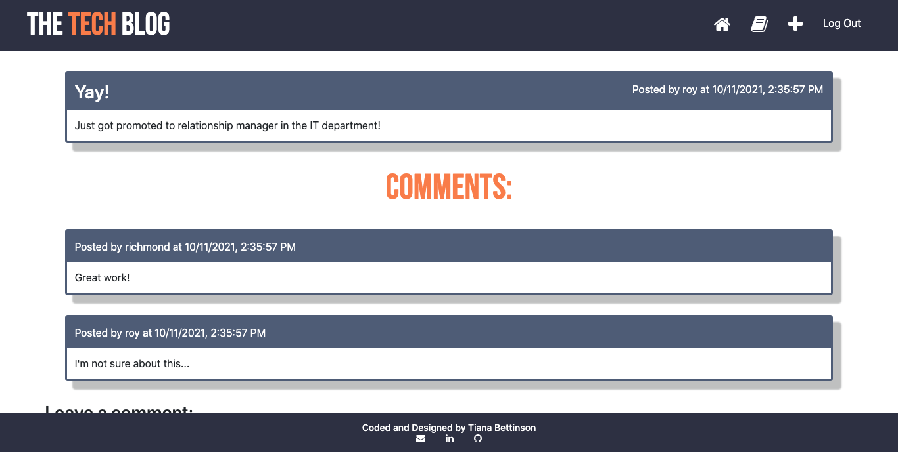
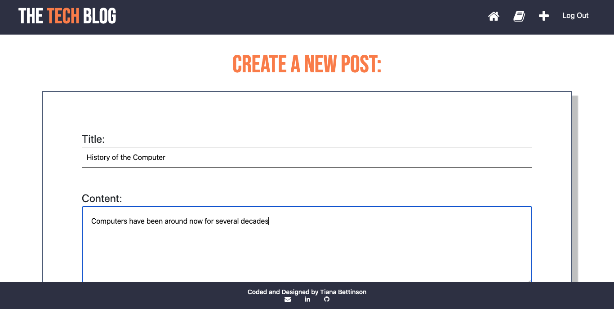

# The Tech Blog
  
  
  ## Table of Contents
  * [Description](#description)
  * [Installation](#installation)
  * [Usage](#usage)
  * [License](#license)
  * [Contributing](#contributing)
  * [Tests](#tests)
  * [Questions](#questions)
  
  ## Description
  This application allows users to view, create, and comment on posts after registering and logging-in.  The application is deployed at [bettinson-techblog.herokuapp.com](https://bettinson-techblog.herokuapp.com/).

  ## Installation
  Download all files and open in your source code editor.  In a terminal, connect to mysql and run “source db/schema.sql” to create the database.  In another terminal, run npm install to ensure all the necessary packages are installed.   Next run “node models/index.js” to create models or tables of the data, and then run “npm run seed” to fill the models with data.  Once all this is complete, run “npm start” to start the application at server 3001.

  ## Usage
  
  Once at either the [Heroku site](https://bettinson-techblog.herokuapp.com/) or running on your local host, you will be redirected to the home page where you see posts from other users.  At the top, there are buttons redirecting to the homepage, dashboard, or to login.  Only the homepage will be accessible to users who are not logged in.  The other buttons will redirect to the log-in page.  

  
  
  Here you can register as a new user or sign in by providing your email, username and a password.  After logging in, you will be directed to your dashboard where you will see all the posts you created.  You can also edit or delete your posts from this page.  
  
  

  When you navigate back to the homepage, you will be able to click on the titles of other users’ posts.  This will redirect you to a page where you can view comments or write your own comment.  There will also be two new buttons at the top of the page: “+” and “Log Out”.  The “+” will redirect you to a page where you will be able to create a new post with a title and content.  To logout, hit the “Log Out” button on the top right of the webpage. 

  

  ## License
  This project is registered under the [MIT License](/LICENSE)

  ## Contributing
  * Tiana Bettinson - tbetti
  
  ## Tests
  * N/A

  ## Questions
  * __GitHub:__ [github.com/tbetti](https://github.com/tbetti)
  * __Email:__ [tiana.bettinson@gmail.com](mailto:tiana.bettinson@gmail.com)
   
  
  _This README was created using the [README Generator](https://github.com/tbetti/readme-generator)_